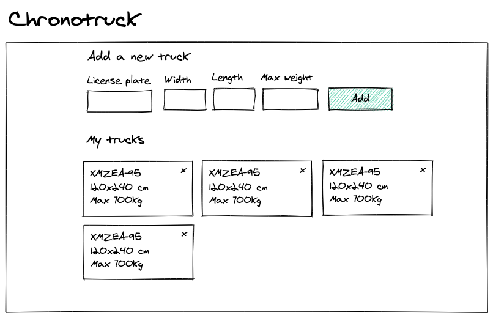

# Front-end Interview

Hello!

If you're here, you're probably applying to work with us at Chronotruck. At the time, we're looking for a "front-end developer" role and this test is to ensure that we could work together.

## The test

What we want you to build to ensure we're on the same page is a web application to manage a company's truck list. The user of the app can **see its trucks list**, **add a new one**, and **delete a truck**.

The trucks must be persisted in a database. The app should communicate with a back-end through a REST API that uses this database. Note that we already provided you the REST API with its database along with this repository. See the installation instructions to get started.

On the front-end side, feel free to make a very simplistic design with whatever CSS framework or Vue component library you feel confident with. We provide you an example of disposition just below.

There are some rules though:

- The truck license plate must match the SIV format
  - Here is the regex to help: `^(?!ss|ww|.[iou]|[iou].)[a-z]{2}[-\s]?\d{3}[-\s]?(?!ss|ww|.[iou]|[iou].)[a-z]{2}$`
- A truck size cannot exceed 1320 (length) x 240 (width) cm
- A truck cannot load more than 28000kg



### Front-end

At Chronotruck, our main front-end library is VueJS. And because of that, that's the main front-end library that should be used in this web application.

A few more things are expected:

- A Vuex store to handle the list of trucks
- Any HTTP client to talk to our REST API
- Any input validation library to ensure the posted data is correct
- Handle server validation errors

Chronotruck heavily relies on PHP with Symfony. But for this test, we provide you a very simplistic NodeJS REST API you can work with.

A few things are expected:

- Minimum knowledge of how to use a REST API
- Input validation / sanitation awareness
- Security awareness

#### List of trucks

```
GET http://localhost:3000/trucks
```

```json
[
  {
    "_id": "60ded26484658900207f4cd4",
    "width": 80,
    "length": 120,
    "maxWeight": 150,
    "licensePlate": "AZ-999-ZZ"
  }
]
```

Returns a list of all the trucks the user has added, including their license plate, their size, and their weight.

#### Create a new truck

```
POST http://localhost:3000/trucks
```

```json
{
  "width": 80,
  "length": 120,
  "maxWeight": 150,
  "licensePlate": "AZ-999-ZZ"
}
```

An endpoint to create a new truck with the license plate, the truck size (width and length), and its max weight capacity.
The list of trucks should be updated right away.

#### Delete a truck

```
DELETE http://localhost:3000/trucks/:id
```

With a single request, I want to be able to delete the truck I've selected. The list of trucks should be updated right away.

## What we will look for

### Front-end
#### HTML markup

We'll look to a clean and coherent HTML markup. What we want to know if you understand how to use the appropriate HTML tags when needed.

#### Accessibility

Is your app fully usable with a keyboard? What about contrast? We'll make sure to check these things and more to ensure your code respects the most common accessibility rules.

Some resources:
- https://developer.mozilla.org/fr/docs/Learn/Accessibility/HTML

#### VueJS best practices

Some resources:
- https://vuejs.org/v2/style-guide/

#### CSS

Although we didn't specify any specific design and won't expect you to make a pixel-perfect integration, we may take a look at your CSS to know how you managed to make the correct disposition. We expect you to know the basics (flex, grid, vars,...).

Some resources:
- https://web.dev/learn/css/

### Misc

We may look for other aspects of your test like:

- How you worked with Git (git workflow, commits, ...)
- How you organized your project (project architecture, naming conventions, ...)
- If you achieved to use your Docker setup and could create a Vue SPA app from the ground up
- Check if your code works as expected
- Even if we won't require testing for this test, if you're confident with it, we may look at it. Otherwise, we will ask you a few things about testing during the interview.

## Get started with API

### Requirements

- Docker and Docker-compose

### Run

To run the local development API server:

```bash
docker-compose up -d
```
